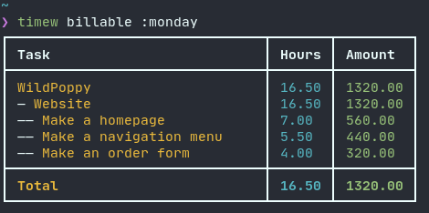

# timew-billable

A [Timewarrior](https://timewarrior.net/) report script that will help you organize your logged work time into structured projects with summarized billable hours. 

This project was inspired by the venerable Emacs org-mode and its built-in clock tables. The goal is to create some of those features for Timewarrior.



Requires Nim with Nimble, version 1.6.6 or compatible.

Version 0.2.4

## Contents

1. <a href="#features">Features</a>
2. <a href="#start">Getting Started</a>
3. <a href="#config">Configuration</a>
4. <a href="#example">Example</a>
5. <a href="#caveats">Caveats</a>
6. <a href="#contrib">Contributing</a>

<div id="features"></div>

## Features

- Generates nested reports for structured projects/subtasks
- Pretty terminal table output
- CSV export/file dump

<div id="start"></div>

## Getting Started

1. Clone this repo and cd into the project directory.
2. Install the nimble dependencies with `nimble install -l`
3. Build a release version with `nim c -d:release src/billable.nim`
4. Move or symlink the build to your ~/.timewarrior/extensions/ directory

<div id="config"></div>

## Configuration

Timewarrior is super simple. It contains hardly any metadata, unlike its companion app, [Taskwarrior](https://taskwarrior.org/).

While you may use this repo for Timewarrior alone, it's intended use is with Taskwarrior & the automatic Timewarrior modify hook. If you're not sure how to use Timewarrior & Taskwarrior together, [read the docs](https://timewarrior.net/docs/taskwarrior/).

In order to make things work correctly, we're going to need to embed our own metadata into your Task/Timewarrior data. This metadata can be adapted to your liking via the [Timewarrior configuration](https://timewarrior.net/docs/configuration/) file.

There is an [example config](./example.cfg) in this repository which contains the configuration defaults. It is meant to be used as a reference. It is not necessary to re-define the default configuration.

Here are the configuration options:  
* `billable` - Your default, billable rate as a float.  
  Default: `0.0`
* `billable.<client>` - Specify a separate billable rate tag for any given task/project.
* `billable.project_marker` - Specify a marker to flag the time entry as a project with a specific hierarchy.  
  Default: `#`
* `billable.task_marker` - Specifiy a marker to flag a specific tag as the task name.  No marker is set by default.  The default behavior is to find the first tag with spaces in it.
* `billable.render` - The render method to use for the report.  Options supported are `terminal` and `csv`.  
  Default: `terminal`

<div id="example"></div>

## Example

I have a web project for a client called "Wild Poppy" who sells "artisan flower arrangements." Said project has many dependant tasks which are:

- Make a homepage
- Make a navigation menu
- Make an order-form page

I would create my Taskwarrior entries as such:

`task add project:#WildPoppy.Website Make a homepage +WildPoppy`  
`task add project:#WildPoppy.Website Make a navigation menu +WildPoppy`  
(...etc)

I do some work for Wild Poppy, then at the end of the month I decide to invoice them.

When I run `timew billable :month WildPoppy` I get this:

```
┌───────────────────────────────┬───────┬─────────┐
│ Task                          │ Hours │ Amount  │
├───────────────────────────────┼───────┼─────────┤
│ WildPoppy                     │ 16.50 │ 1320.00 │
│ — Website                     │ 16.50 │ 1320.00 │
│ —— Make a homepage            │ 7.00  │ 560.00  │
│ —— Make a navigation menu     │ 5.50  │ 440.00  │
│ —— Make an order form         │ 4.00  │ 320.00  │
├───────────────────────────────┼───────┼─────────┤
│ Total                         │ 16.50 │ 1320.00 │
└───────────────────────────────┴───────┴─────────┘
```

Maybe later on Wild Poppy gets really successful and has tons of work for me. We negotiate a special bulk-rate, separate from my usual rate. All I have to do is go into my configuration and add `billable.WildPoppy = 70' to give them a special rate.

The only limit to the nested hierarchy is your sanity :) You could do something like this:
`task add #Renovation.kitchen.sink Decide on which faucets to use +reno` and the report will nest and summarize it accordingly:

```
┌───────────────────────────────┬───────┬─────────┐
│ Task                          │ Hours │ Amount  │
├───────────────────────────────┼───────┼─────────┤
│ Renovation                    │ 1.0   │ 150.00  │
│ — kitchen                     │ 1.0   │ 150.00  │
│ —— sink                       │ 1.0   │ 150.00  │
│ ——— Decide on faucets to use  │ 1.0   │ 150.00  │
├───────────────────────────────┼───────┼─────────┤
│ Total                         │ 1.0   │ 150.00  │
└───────────────────────────────┴───────┴─────────┘
```
<div id="caveats"></div>

## Caveats

1. Billable hour accuracy is truncated.

   Billable hours are calculated by the second and rounded at the hundredth (2nd) decimal place.  This sacrifice is made to help the table add up from bottom to top, or when multiplying hours against the rate at any given point in the table.

   Without this, rounding errors will occur and the table will seem inconsistent.  Generally speaking the table is accurate enough.

I am open to ideas and contributions.

<div id="contrib"></div>

## Contributing

If you would like to contribute to the project, please fork this repository and submit your PRs to branch `devel`.

Issues and discussions() are also welcome :)
